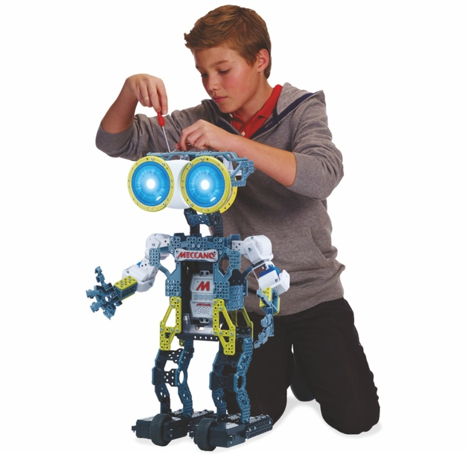

# Framework CSDR

<h3>Предисловие</h3>

Применяя framework CSDR (Conditions, Space, Distribution и Realization) можно быть уверенным, что программирование будет на уровне сконцентрированной сборки проекта.

<h3>Навигация</h3>

1. <a href="#Конструирование">Конструирование</a>

    1.1. <a href="#Тип">Тип</a>
    
    1.2. <a href="#Содержимое">Содержимое</a>
    
    1.3. <a href="#Сохранение">Сохранение</a>
    
2. <a href="#Ссылки">Ссылки</a>
    

<h2>Конструирование</h2>

<h3>Тип</h3>

Конструирование принято в виде пошагового. Такое конструирование даст возможность одновременной работы над проектом нескольким участникам, где каждый может увидеть, что в данный момент конструирует напарник. А так же за счёт пошагового конструирования появляется возможность создавать сборки, где временно можно убрать какую либо часть действий, обозначив их каким то общим названием, например "будущий раздел такой то, работа приостановлена" или "изменение базы данных, применить ночью".

<h3>Содержимое</h3>

У каждого действия необходимо отмечать:

1. **Компонент**:

     1.1. Рефлекс
     
     1.2. Место
     
     1.3. Связь
     
     1.4. Реакция

2. **Индификатор** //номер в компоненте

3. **Действие**:

     3.1. Добавить
     
     3.2. Изменить
     
     3.3. Удалить
     
     3.4. Зафиксировать // чтобы убрать возможность удаления
     
     3.5. Разафиксировать

4. **Значение**

     - у рефлекса это ориентир (текст), расчёты (текст), места (массив индификаторов мест (для мест с ролями "запросы" и "ожидание" можно дополнять внутренним списком индификаторов мест)), права (код).
    
     - у мест это смысл (текст), роль (массив), связи (индификатор связи), вложение (для роли "атрибутов" текст, массив).
     
     - у связей это тип (текст), возможности и приобретение (два списка для индификаторов мест (или массив array("название_переменной" => "индефикатор_места") при типе "глобальное")), образцы возможности и приобретение (массив), реакция (индификатор реакции).
    
     - у реакций это способность (код).
     
5. **Авторство** // имя того кто действие совершил
     
6. **Дата** // время совершенного действия

<h3>Сохранение</h3>

Формат данных выбран в виде массива. Каждое действие необходимо сохранять в json файл. 

 

<h2>Ссылки</h2>

Далее по теме: 

 <a href="https://money.yandex.ru/to/410013830829482/500000">Мой баланс (не трусьте, пополняйте!)</a>
