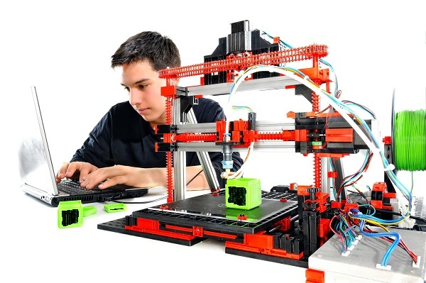
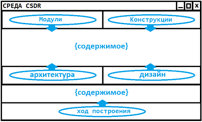

# Framework CSDR

<h3>Предисловие</h3>

С Framework'ом CSDR вы обретаете возможность визуально программировать <a href="https://github.com/it-architector/structure.csdr">структурированный код</a>.

<h3>Навигация</h3>

1. <a href="#Среда">Среда</a>

     1.1. <a href="#Развёртка">Развёртка</a>
     
     1.2. <a href="#Области">Области</a>
     
     1.3. <a href="#Аутентификация">Аутентификация</a>
     
2. <a href="#Сборка">Сборка</a>

    2.1. <a href="#Действия">Действия</a>
    
    2.2. <a href="#Компиляция">Компиляция</a>
     
3. <a href="#Нужны-разработчики">Нужны разработчики</a>
     
4. <a href="#Ссылки">Ссылки</a>
    

<h2>Среда</h2>

<h3>Развёртка</h3>

Среда сборки должна разворачиваться в виде программы на операционные системы: windows, mac и *nix.

<h3>Области</h3>

Для сборки проекта заданы такие области среды:
1. Программист
2. Проект
    1. Архитектура
    2. Дизайн
3. Ход сборки

<h3>Аутентификация</h3>

Без авторизации все области заблокированы, кроме области "Программист". Здесь будет форма для идентификации, где достаточно ввести в свободной форме логин.

По умолчанию каждый авторизованный имеет права доступа к таким областям:
1. Проект
2. Архитектура
3. Дизайн
4. Ход сборки
    

<h2>Сборка</h2>

<h3>Действия</h3>

Под действиями будем считать манипуляции в таких областях: проект, архитектура и дизайн.

Изначально области архитектуры и дизайна недоступны, их открытие начинается после того как выбрали или создали проект. Как только это совершили, в области **проект** можно будет:
1. Задать название проекта
2. Определить тип проекта
3. Управлять конструкциями

В области **архитектуры**:
1. Управлять рефлексией

 

В области **дизайна**:
1. Управлять местом
2. Управлять связью
3. Управлять реакцией

 

Каждые произведенные действия будут записываться в файл проекта, где у каждого действия будет отмечено:

1. **Тип действия**:

     1.1. Добавить
     
     1.2. Изменить
     
     1.3. Удалить
     
     1.4. Зафиксировать // чтобы убрать возможность удаления
     
     1.5. Разафиксировать
2. **Компонент**:

     1.1. Параметр

     1.2. Конструкция

     1.3. Рефлекс
     
     1.4. Место
     
     1.5. Связь
     
     1.6. Реакция

3. **Индификатор** //номер для компонента

4. **Значение** //значение для компонента согласно <a href="https://github.com/it-architector/structure.csdr">структуре CSDR</a>
     
5. **Авторство** // определение программиста
     
6. **Дата** // Дата совершенного действия

<h3>Компиляция</h3>

В области **хода сборки** можно увидеть не только лог ваших действий, но и создать структурированный код проекта кнопкой компиляции. В созданный код будут автоматически добавлены функции примененных в проекте ролей.

    

<h3>Нужны разработчики</h3>

Можете помочь в визуализации? -> Помогите! Связь по скайпу (poryadok2017) или емейлу (it@framework-csdr.ru)

<a href="./Framework CSDR DEMO (1.0).zip">Скачать прототип визуализации</a> (частично рабочий)

<a href="./Framework CSDR DEMO-ROLES (1.0).zip">Скачать прототип выбора ролей</a> (частично рабочий)

<h2>Ссылки</h2>

Проект поддерживают:

 <a target="_blank" href="http://develnext.org/ru/?from=framework+csdr">DevelNext</a> 
